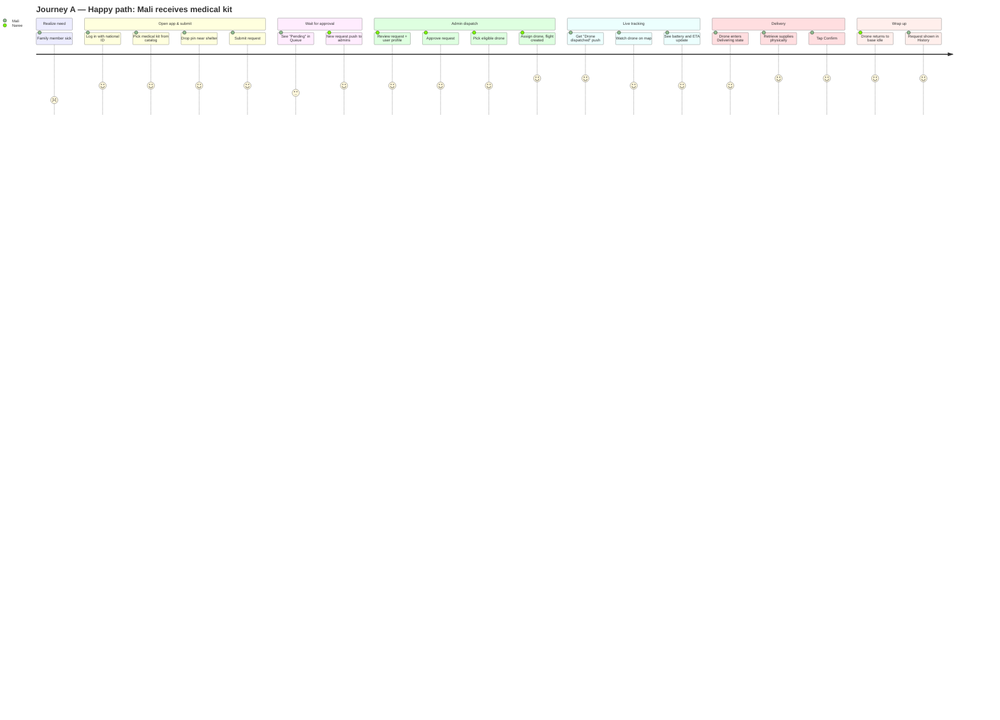
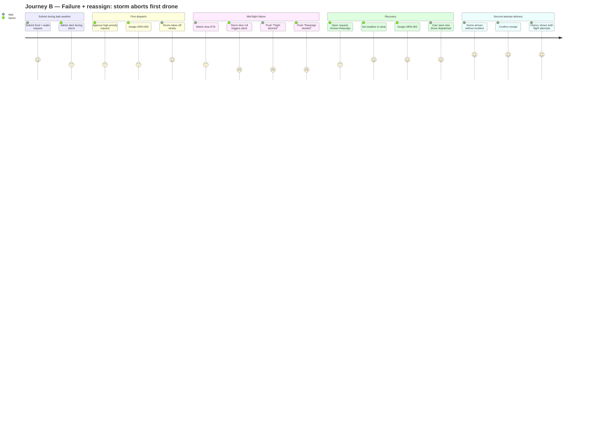

# DroneAid — User Journey Map

Two journeys, two personas. Mermaid source inline; rendered PNGs in `diagrams/`.

- **Persona 1 (User):** Mali Suwan — 37, refugee mother of two, displaced to a shelter, limited cellular signal, smartphone literate but cautious.
- **Persona 2 (Admin):** Naree Charoen — 29, relief coordinator, manages dispatch from a forward base, monitors weather + fleet.

Full personas in [03-personas.docx](03-personas.docx).

Emotion scale (Mermaid `journey` syntax): **1 = very negative · 3 = neutral · 5 = very positive**.

---

## Journey A — Happy path (medical supplies delivered)

### Context

Mali's youngest has a fever. She needs a medical kit (paracetamol, ORS, basic antiseptic) tonight. Weather is clear. Naree is on-shift with 6 idle drones at the warehouse 4 km away.

### Stages (annotated)

| # | Stage | Mali's emotion | Naree's emotion | Touchpoint | System event |
|---|---|---|---|---|---|
| 1 | Mali realizes she needs supplies | 2 (worried) | — | Personal | — |
| 2 | Mali opens DroneAid, logs in with ID | 4 | — | App: Login | Auth |
| 3 | Mali browses catalog, picks Medical Kit ×1 | 4 | — | App: Request | — |
| 4 | Mali drops pin near shelter, submits | 4 | — | App: Request | `submitRequest` callable |
| 5 | Mali sees status "Pending" in Queue | 3 | — | App: Queue | Live stream |
| 6 | Naree sees new request alert | — | 4 | App: Requests + FCM push | FCM fan-out |
| 7 | Naree opens request, sees Mali's profile + items | — | 4 | App: Request Manage | — |
| 8 | Naree taps Approve; stock decrements | — | 4 | App: Request Manage | `approveRequest` |
| 9 | Naree picks DRN-003 from eligible drone list | — | 4 | App: Drone picker | — |
| 10 | Naree taps Assign; flight created, drone takes off | — | 5 | App: Drone picker | `assignDrone` → flight |
| 11 | Mali gets push "Drone dispatched, ETA 18 min" | 5 | — | FCM + Notifications | `onFlightWritten` |
| 12 | Mali watches drone move across map | 4 | — | App: Tracking | Client interpolation |
| 13 | Mali sees battery 78%, ETA 6 min | 4 | — | App: Tracking | — |
| 14 | Drone arrives, status changes to Delivering | 4 | — | App: Tracking | `tickFlights` transition |
| 15 | Mali hears drone outside, retrieves supplies | 5 | — | Physical | — |
| 16 | Mali taps Confirm in app | 5 | — | App: Confirm | `confirmDelivery` |
| 17 | Drone returns, lands at base, drone returns to idle | — | 5 | App: Control | `tickFlights` returning → idle |
| 18 | Request appears in History | 5 | — | App: History | — |

### Mermaid source



### Pain points + opportunities (Journey A)

| Pain | Mitigation in product |
|---|---|
| Wait between submit and approval feels uncertain | Live status streaming; push when admin opens the request |
| Tracking the dot on a small map may strain low-end phones | Cap fleet markers visible to current flight + cache tiles |
| Confirm step easy to miss | Persistent banner + push; later: 24h auto-confirm reminder |

---

## Journey B — Failure + reassign (storm aborts first drone)

### Context

Mali submits a food + water request. Weather state is `storm` (Naree set it earlier when wind picked up). She expects delays but doesn't realize storms can fully abort flights.

### Stages

| # | Stage | Mali's emotion | Naree's emotion | Touchpoint | System event |
|---|---|---|---|---|---|
| 1 | Mali submits food kit + water ×2 | 4 | — | App: Request | `submitRequest` |
| 2 | Naree sees alert; weather is storm | — | 3 | App + FCM | — |
| 3 | Naree approves anyway (high priority) | — | 3 | App: Request Manage | `approveRequest` |
| 4 | Naree picks DRN-005 (idle, in range) | — | 3 | App | `assignDrone` |
| 5 | Drone takes off at reduced speed (weather mod 0.5) | 4 | 3 | App: Tracking + Control | — |
| 6 | Mali watches drone struggle with slow ETA | 3 | — | App: Tracking | — |
| 7 | `tickFlights` rolls 20% storm dice → ABORT | — | 2 | Backend | Flight status `aborted` |
| 8 | Mali gets push "Flight aborted, drone returning" | 2 | — | FCM | `onFlightWritten` |
| 9 | Naree gets push "DRN-005 aborted, reassign needed" | — | 2 | FCM | — |
| 10 | Naree opens request, taps Reassign | — | 3 | App: Request Manage | — |
| 11 | Naree filters fleet: only DRN-002 + DRN-007 OK | — | 3 | App | — |
| 12 | Naree sets weather to `wind` (storm passing) | — | 4 | App: Weather panel | `setWeather` |
| 13 | Naree assigns DRN-002 | — | 4 | App | `assignDrone` (2nd flight) |
| 14 | Mali sees new drone dispatched, restored hope | 4 | — | FCM + Tracking | — |
| 15 | Drone arrives without incident | 5 | — | App: Tracking | — |
| 16 | Mali confirms, history shows both flights | 5 | — | App: History | — |

### Mermaid source



### Pain points + opportunities (Journey B)

| Pain | Mitigation in product |
|---|---|
| User unaware that storm can fully ground drones | Show weather badge + warning banner on Tracking; explain in onboarding |
| Reassign step requires admin to open Request Manage again | Surface Reassign action directly from failure push notification |
| Two flights on one request can confuse users | History entry groups attempts under the same `requestId` |

---

## How to render the PNGs

From the repo root:

```bash
npx --yes @mermaid-js/mermaid-cli -i docs/04-journey-map.md -o docs/diagrams/04-journey-map.png
```

Mermaid CLI extracts every fenced ```mermaid block in the input markdown and emits one PNG per block. Output: `04-journey-map-1.png` (Journey A) and `04-journey-map-2.png` (Journey B).
