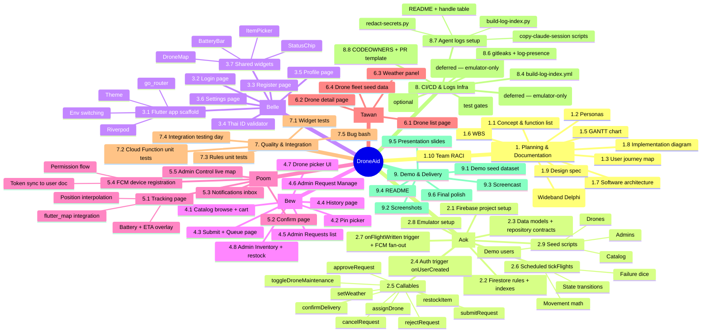

# DroneAid — Work Breakdown Structure (WBS)

Deliverable-oriented decomposition of all project work into ~5 levels. Owner shown in brackets.

## Mermaid mindmap



## Linear breakdown (for easier estimation)

| WBS | Item | Owner | Est. days |
|---|---|---|---|
| **1** | **Planning & Documentation** | All | 1.0 |
| 1.1–1.10 | All 10 planning artifacts (parallel to setup) | All | 1.0 |
| **2** | **Backend** | Aok | 8.0 |
| 2.1 | Firebase project setup | Aok | 0.5 |
| 2.2 | Firestore rules + indexes | Aok | 1.0 |
| 2.3 | Data models + repository contracts | Aok | 0.5 |
| 2.4 | onUserCreated trigger | Aok | 0.25 |
| 2.5 | Callables (9 functions) | Aok | 2.5 |
| 2.6 | Scheduled tickFlights | Aok | 1.5 |
| 2.7 | onFlightWritten + FCM | Aok | 0.75 |
| 2.8 | Emulator + rules tests | Aok | 0.5 |
| 2.9 | Seed scripts | Aok | 0.5 |
| **3** | **Identity + Shared UI** | Belle | 5.5 |
| 3.1 | Flutter scaffold | Belle | 0.5 |
| 3.2 | Login | Belle | 0.5 |
| 3.3 | Register | Belle | 0.75 |
| 3.4 | Thai ID validator | Belle | 0.5 |
| 3.5 | Profile | Belle | 0.5 |
| 3.6 | Settings | Belle | 0.5 |
| 3.7 | Shared widgets (4 widgets) | Belle | 2.25 |
| **4** | **Request Domain** | Bew | 6.0 |
| 4.1 | Catalog browse + cart | Bew | 1.0 |
| 4.2 | Pin picker | Bew | 0.5 |
| 4.3 | Submit + Queue | Bew | 1.0 |
| 4.4 | History | Bew | 0.5 |
| 4.5 | Admin Requests list | Bew | 0.75 |
| 4.6 | Admin Request Manage | Bew | 1.0 |
| 4.7 | Drone picker UI | Bew | 0.5 |
| 4.8 | Admin Inventory + restock | Bew | 0.75 |
| **5** | **Tracking + Maps** | Poom | 5.5 |
| 5.1 | Tracking page (map + interpolation + overlay) | Poom | 2.0 |
| 5.2 | Confirm page | Poom | 0.5 |
| 5.3 | Notifications inbox | Poom | 0.75 |
| 5.4 | FCM device registration | Poom | 1.0 |
| 5.5 | Admin Control live map | Poom | 1.25 |
| **6** | **Fleet Domain** | Tawan | 4.0 |
| 6.1 | Drone list | Tawan | 0.75 |
| 6.2 | Drone detail | Tawan | 1.25 |
| 6.3 | Weather panel | Tawan | 0.75 |
| 6.4 | Drone fleet seed data | Tawan | 1.25 |
| **7** | **Quality & Integration** | All | 3.0 |
| 7.1–7.5 | Tests + integration day + bug bash | All | 3.0 |
| **8** | **CI/CD & Logs Infra** | Aok + Belle | 2.5 |
| 8.1 | ci.yml | Aok | 0.5 |
| 8.2–8.3 | ~~deploy workflows~~ (deferred — emulator-only) | Aok | 0 |
| 8.4 | build-log-index.yml | Aok | 0.25 |
| 8.5 | claude-review.yml (optional) | Aok | 0.25 |
| 8.6 | gitleaks + log-presence | Aok | 0.5 |
| 8.7 | Agent logs setup | Belle | 0.5 |
| 8.8 | CODEOWNERS + PR template | Belle | 0.25 |
| **9** | **Demo & Delivery** | All | 2.0 |
| 9.1 | Seed dataset | Aok | 0.5 |
| 9.2–9.3 | Screenshots + screencast | Poom + Bew | 0.5 |
| 9.4 | README | Aok | 0.25 |
| 9.5 | Presentation slides | Tawan | 0.5 |
| 9.6 | Final polish | All | 0.25 |
|   | **Total person-days** |  | **37.5** |
|   | **Available** (5 devs × 14 days) |  | **70.0** |
|   | **Buffer (slack + meetings + bug fix)** |  | **32.5** |

Plenty of buffer because we estimated pure feature work; the rest absorbs meetings, blockers, polish, demo prep iterations.

## Render the PNG

```bash
npx --yes @mermaid-js/mermaid-cli -i docs/06-wbs.md -o docs/diagrams/06-wbs.png
```
