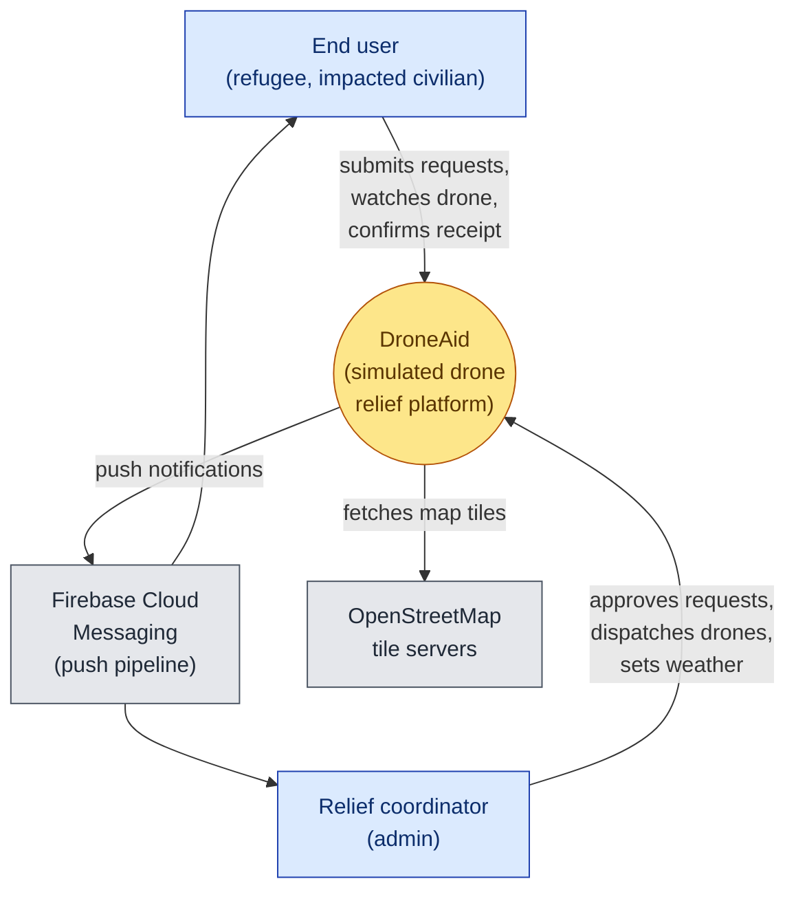
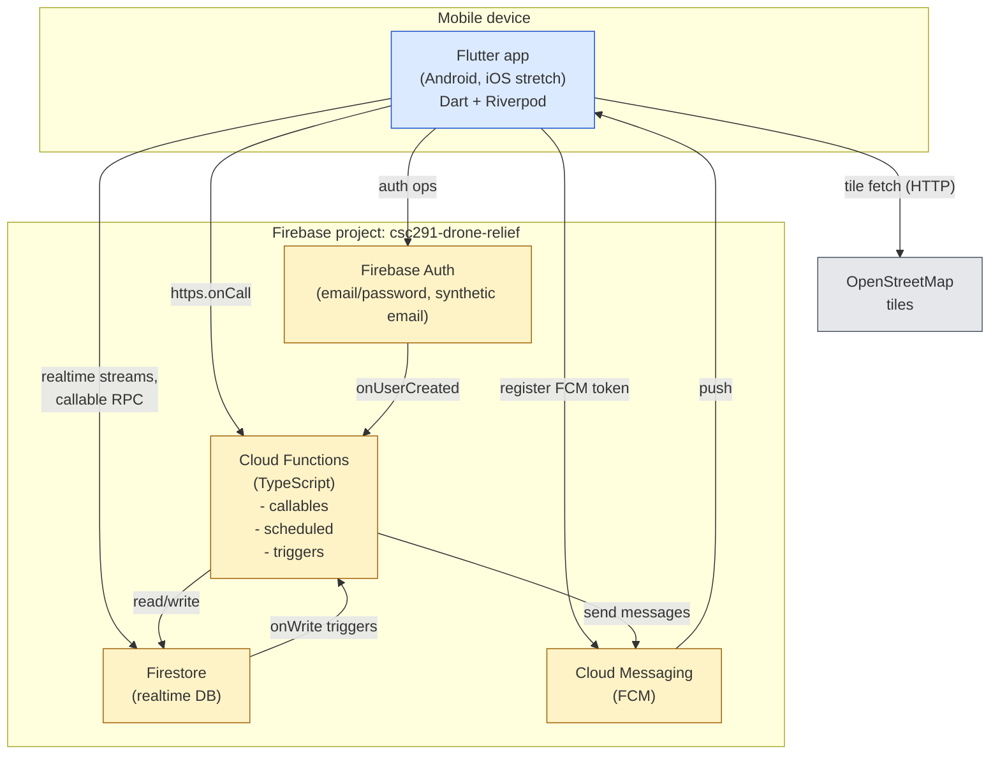
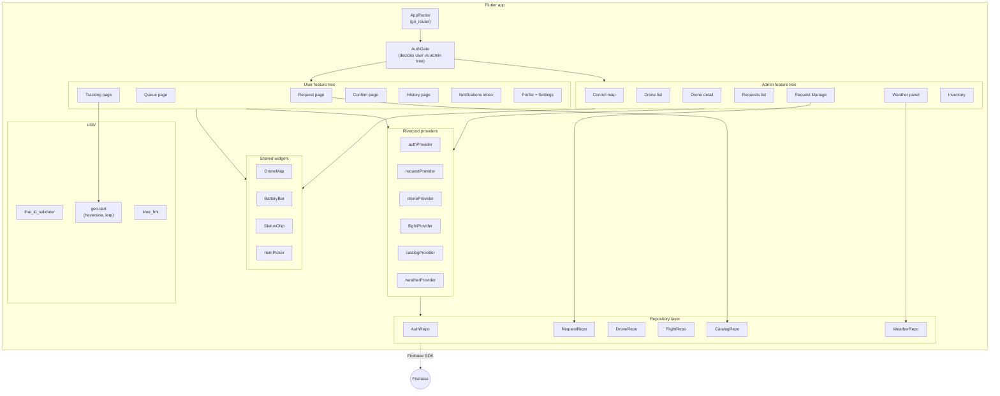
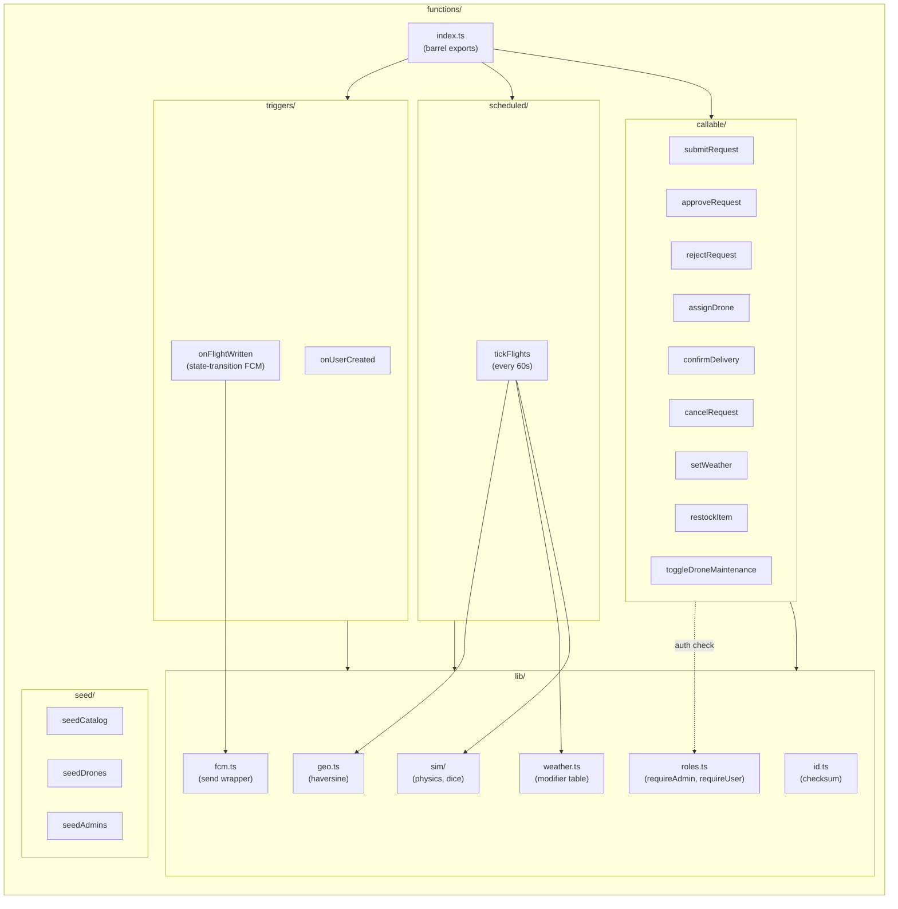

# DroneAid — Software Architecture

C4-style: context → containers → component drill-down.

---

## 1. System context (C4 Level 1)



External actors: end user, admin. External systems: FCM (Google), OSM tiles. Everything else is "us".

---

## 2. Containers (C4 Level 2)



Four Firebase containers all in one project. Flutter is the only client.

---

## 3. Flutter app — internal components (C4 Level 3)



### Layer responsibilities

| Layer | Owns |
|---|---|
| **Pages** (`features/user/*`, `features/admin/*`) | UI only. Reads state from providers, calls repo methods through providers. |
| **Providers** (`providers/*`) | Riverpod state + side effects. Streams from repos, debounces UI, holds form state. |
| **Repositories** (`data/repositories/*`) | Single touchpoint to Firebase SDK. Returns models, never Firestore types. Mockable for tests. |
| **Models** (`data/models/*`) | Pure Dart classes with `fromMap`/`toMap`. No SDK imports. |
| **Shared widgets** (`widgets/*`) | Stateless reusables. Owned by Belle, consumed everywhere. |
| **Utils** (`utils/*`) | Pure functions: geo math, ID validation, time formatting. |

### Why this layering

- Pages never import `cloud_firestore` directly → swapping to a different backend or mocking in tests is local change.
- Providers own caching + lifecycle → screens don't redo work on rebuild.
- Repos return models with named fields → no `data['status']` string scattering.

---

## 4. Cloud Functions — internal components



### Function responsibilities

| Component | Purpose |
|---|---|
| `callable/*` | One `https.onCall` per business action. Validate input + role; perform Firestore transaction; return result. |
| `scheduled/tickFlights` | Cron every 60s. Pulls active flights, advances state, rolls failures, writes transitions. |
| `triggers/onUserCreated` | Auth trigger. Creates `users/{uid}` with role=user. |
| `triggers/onFlightWritten` | Firestore trigger. On flight status change, fans out FCM to user + admins. |
| `lib/sim` | Pure sim functions, testable in isolation. |
| `lib/roles` | `requireAdmin(context)`, `requireUser(context)` helpers. |
| `seed/*` | Idempotent scripts to populate Firestore for demo. |

---

## 5. Cross-cutting concerns

| Concern | How it's handled |
|---|---|
| **Auth** | Firebase Auth on the wire; `context.auth.uid` + `users/{uid}.role` for authorization inside callables. |
| **Realtime** | Firestore listeners for queue, drone, flight, weather. Battery + position derived client-side from stable flight plan doc. |
| **Concurrency** | Stock decrement, drone assignment use Firestore transactions inside callables. |
| **Security rules** | DENY direct writes to mutable collections; only Functions write. |
| **Failure handling** | All callable returns include error codes via `HttpsError`; client maps codes to localized messages. |
| **Testing** | Widget tests with mock repos; Function tests against emulator; rules tests via `@firebase/rules-unit-testing`. |
| **Observability** | Cloud Functions logs; Firestore audit collection deferred (non-goal v1). |

---

## 6. Render the PNG

```bash
npx --yes @mermaid-js/mermaid-cli -i docs/07-software-architecture.md -o docs/diagrams/07-architecture.png
```

Output: one PNG per fenced ```mermaid block, named `07-architecture-{1..4}.png`.
