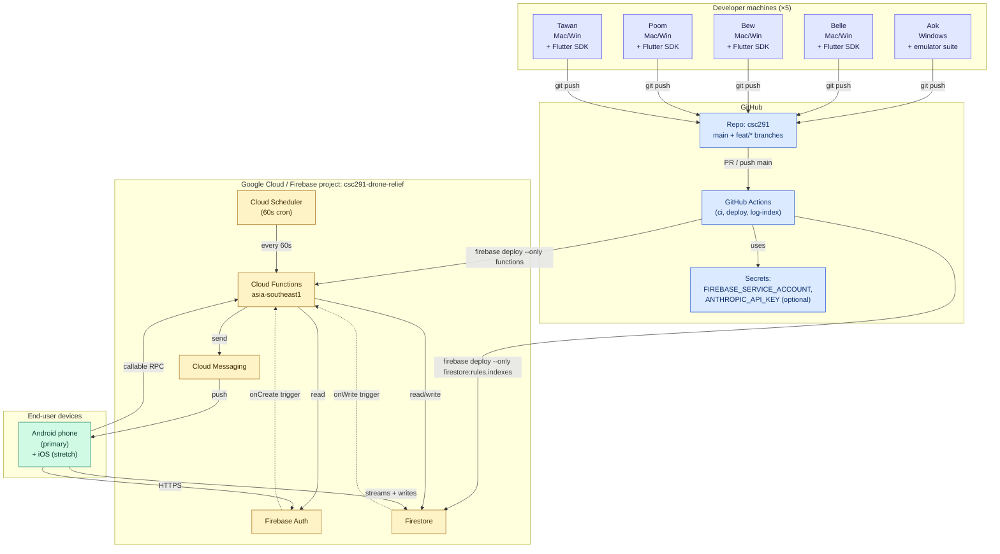
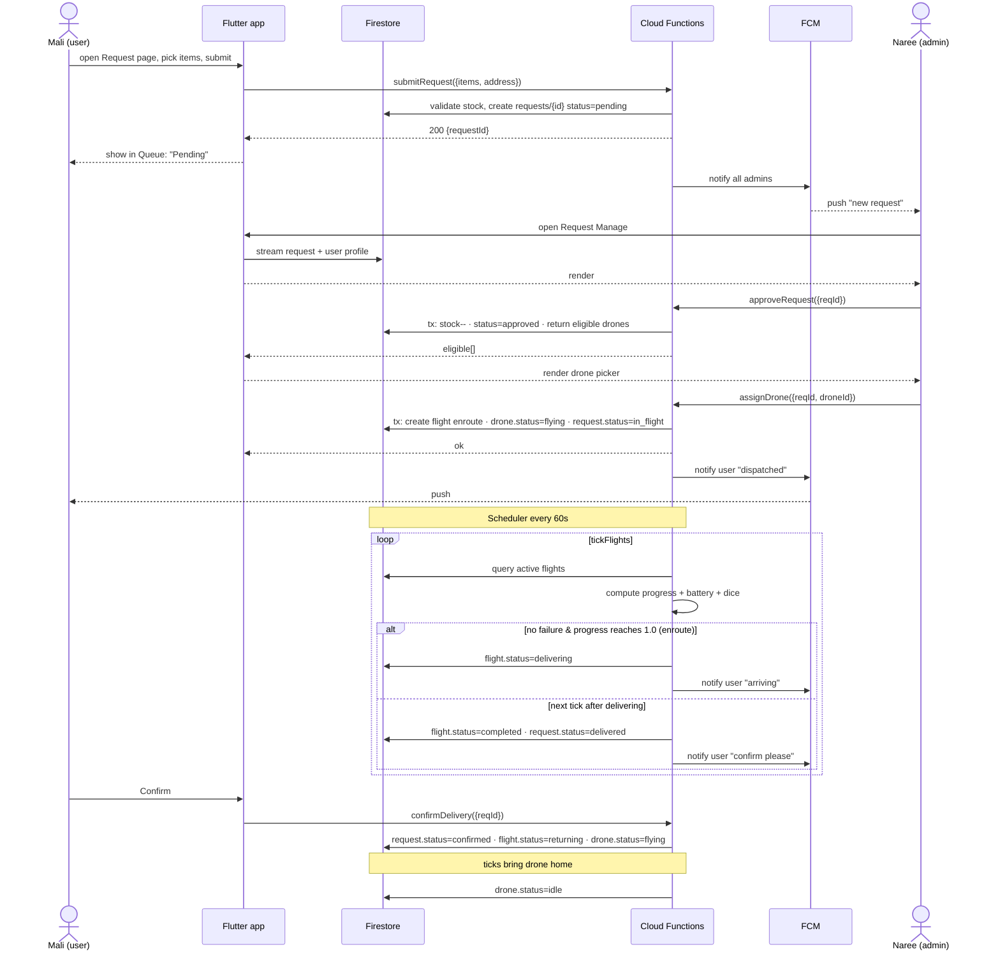
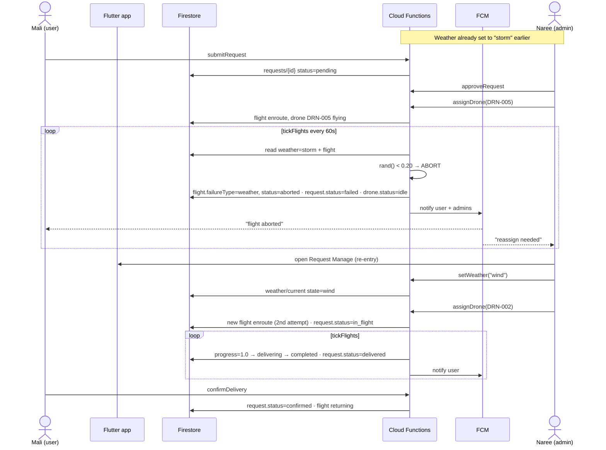
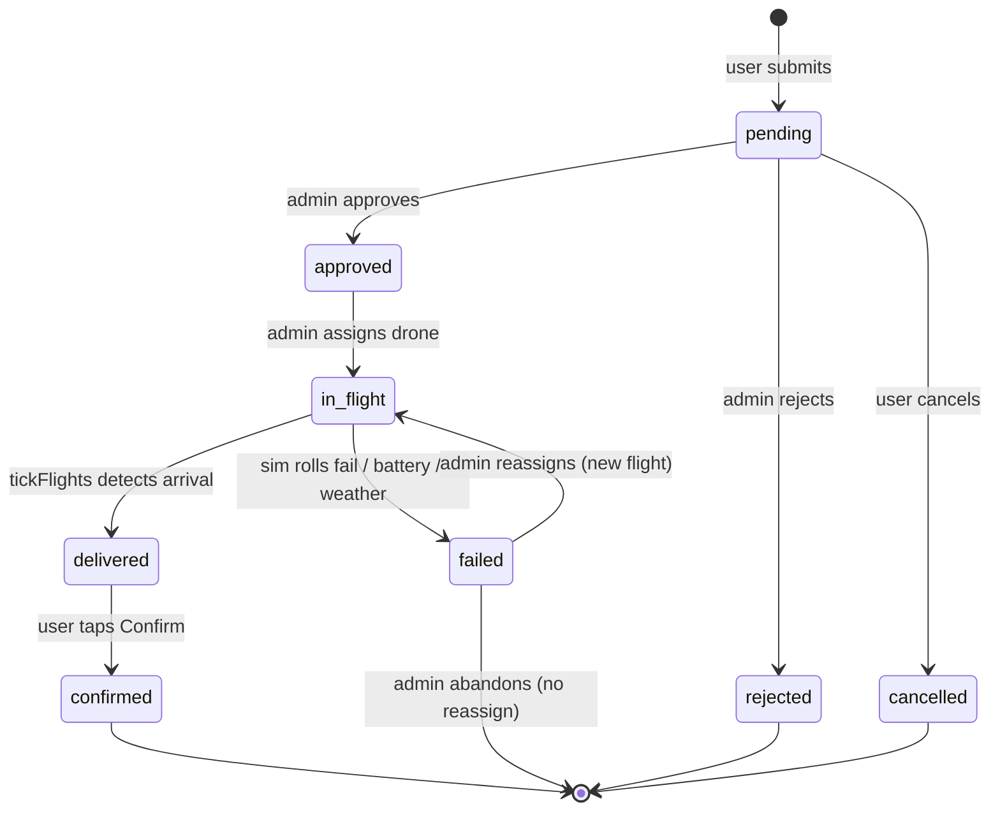
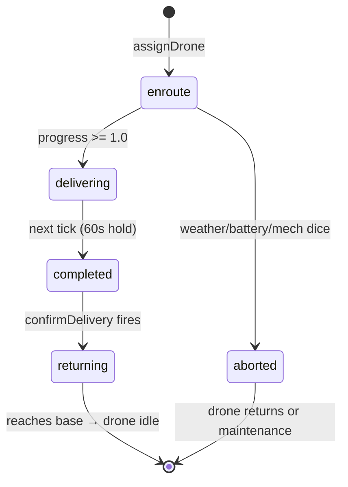
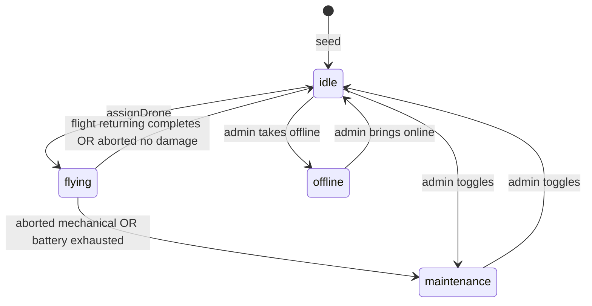
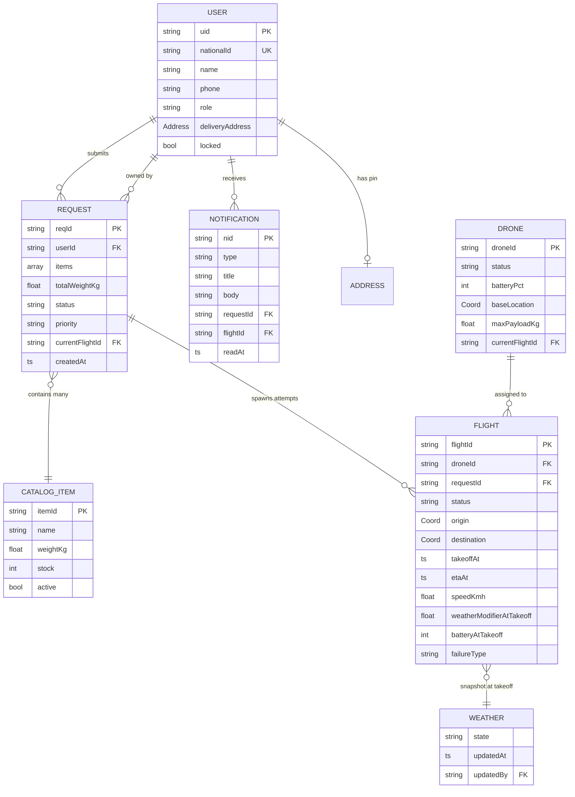

# DroneAid — Implementation Diagrams

Concrete views of how the architecture runs: deployment, sequences, state, and data.

---

## 1. Deployment view



---

## 2. Sequence — happy-path delivery



---

## 3. Sequence — storm aborts mid-flight, admin reassigns



---

## 4. Request status state machine



---

## 5. Flight status state machine



---

## 6. Drone status state machine



---

## 7. Entity-relationship (Firestore collections)



---

## 8. Render the PNGs

```bash
npx --yes @mermaid-js/mermaid-cli -i docs/08-implementation-diagram.md -o docs/diagrams/08-implementation.png
```

Mermaid CLI emits one PNG per fenced block: `08-implementation-1.png` … `08-implementation-7.png`.
