# 10 — Prototype design notes

Screenshots captured from the interactive prototype (`DroneAid Prototype.html`) at viewport **390 × 844** (iPhone-class portrait). Each section pairs a screenshot with the contract a developer needs to implement the page in Flutter against the existing `firestore.rules` + Cloud Functions.

The page IDs (`P-U-XX` / `P-A-XX`) match `docs/09-page-flow-design.md`. Asset filenames are kept stable so a teammate can grep `P-U-04_queue.png` and find both the image and these notes.

Shared chrome (every page):
- **App bar:** brand mark + "DroneAid" + role badge ("· Admin" for staff).
- **Right-side icons:** light/dark toggle, notifications bell, profile avatar. The admin bar swaps the bell for a weather chip (current state) and a gear that deep-links to `P-A-06`.
- **Bottom nav (user):** Request · Queue · Tracking · History · Profile.
- **Top tabs (admin):** Requests · Drones · Control · More (More → Weather; Inventory reached programmatically via `actions.go("admin.inventory")`, so a real implementation needs an explicit link from the More tab — see P-A-07 notes).
- **Type / color:** Material-3-ish; primary teal `#1f6f6c`-ish, accent for "Urgent", warm yellow for "Pending", red for "Failed/Cancelled", grey-green for "Confirmed".

> Implementation defaults referenced below: Riverpod for state, `go_router` routes per `09-page-flow-design.md`, `cloud_firestore` for reads, `cloud_functions` for writes (rules deny direct client writes on most collections).

---

## P-U-01 — Log in

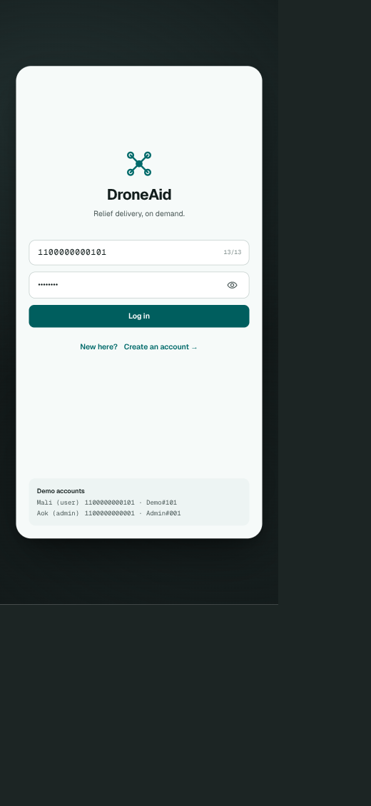

**Purpose.** Auth gate. Sole entry point for unauthenticated users.

**Layout.**
- Centered brand mark + wordmark + tagline "Relief delivery, on demand."
- Two text fields:
  - `13-digit national ID` (numeric keyboard, 13/13 counter on right).
  - `Password` with show/hide eye toggle.
- Primary CTA: `Log in` (filled, full width).
- Secondary link row: "New here?  Create an account →" → `P-U-02`.
- Demo accounts footer card (prototype only — strip in prod builds).

**Validation.**
- National ID exactly 13 digits; client-side check via existing `app/lib/utils/thai_id_validator.dart`.
- Password ≥ 8 chars (Firebase Auth default).

**Behaviour.** Sign in via Firebase Auth using the synthetic-email pattern `<nationalId>@drone-aid.local` (per spec §5). On success, router redirects based on the `role` field of `users/{uid}`:
- `role: "user"` → `/user/home` (which renders P-U-03 in this prototype).
- `role: "admin"` → `/admin/requests` (P-A-01).

**Errors.** Inline below password: "Wrong national ID or password." (never tell which one is wrong). Lock after 5 attempts for 60 s (matches spec §5).

---

## P-U-02 — Create an account

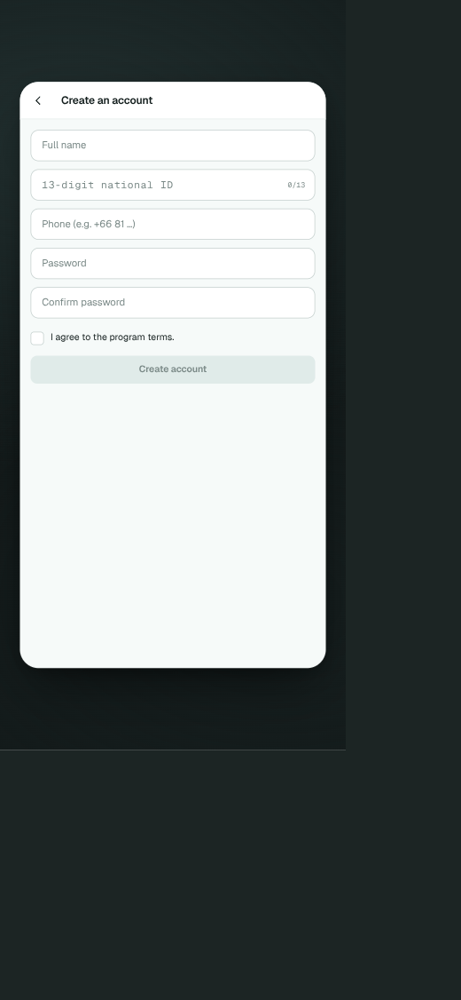

**Purpose.** Self-serve user registration. Admins are never created from the app.

**Layout.**
- Back arrow + "Create an account" header.
- Stacked fields: `Full name`, `13-digit national ID` (with counter), `Phone (+66…)`, `Password`, `Confirm password`.
- "I agree to the program terms." checkbox.
- Primary CTA `Create account` — **disabled until** all required fields are valid AND the checkbox is ticked.

**Validation.** Same ID + phone regex (`^\+?\d{10,15}$`) used by the `updateProfile` callable in `functions/src/callable/updateProfile.ts`. Password and confirm must match.

**Behaviour.** Calls `createUserWithEmailAndPassword(<nationalId>@drone-aid.local, password)`. The `onUserCreated` Auth trigger (`functions/src/triggers/onUserCreated.ts`) provisions the `users/{uid}` doc with `role: "user"` automatically. After provisioning resolves, router pushes to `/user/home`.

---

## P-U-03 — Request supplies (user home)

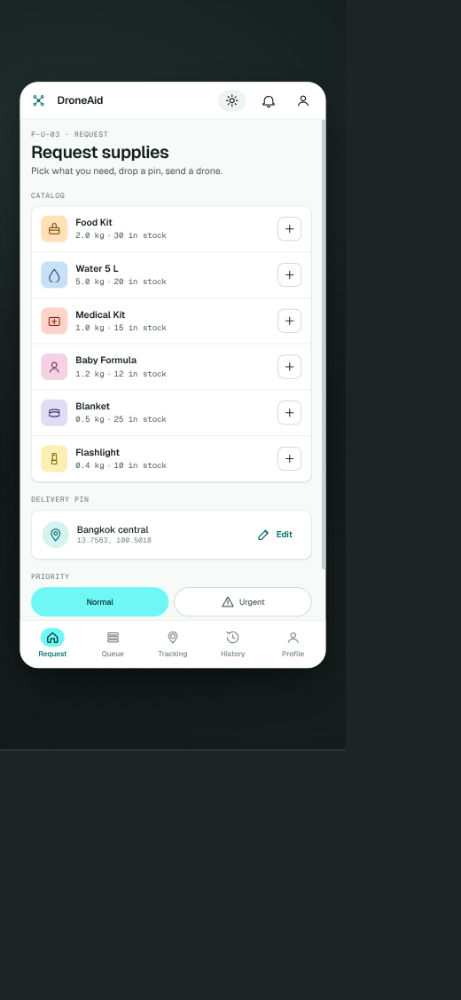

**Purpose.** Default landing tab for end users; build a cart and submit a relief request.

**Sections.**
1. **Header.** Eyebrow `P-U-03 · REQUEST`, h1 "Request supplies", subtitle "Pick what you need, drop a pin, send a drone."
2. **Catalog list.** One row per `catalog/{itemId}` doc where `active == true`:
   - Coloured square icon + item name.
   - "`{weightKg} kg · {stock} in stock`" mono detail line.
   - Trailing `+` button → adds 1 to local cart (max 10 per item per `submitRequest` schema).
3. **Delivery pin card.** Pin icon + place label + "lat, lng" + `Edit` button (opens a map picker — wire to `flutter_map`, `latlong2`).
4. **Priority toggle.** Pill group `Normal` / `Urgent` (with warning icon). Default `Normal`.
5. **Submit CTA.** "Add items to submit" — copy switches to "Submit request" once cart is non-empty; disabled when no items selected, when total weight > 6.0 kg, or when any selected item just went out of stock.

**Behaviour.** On submit, call `submitRequest` callable. On success, snackbar "Request sent — DroneAid is reviewing." and pop to P-U-04 (Queue) with the new card visible.

**Empty / error states.**
- Catalog empty (`active` list returns nothing): show a soft empty state "No items available right now."
- Network error: snackbar + retry on the catalog query.

---

## P-U-04 — Your queue (live updates)

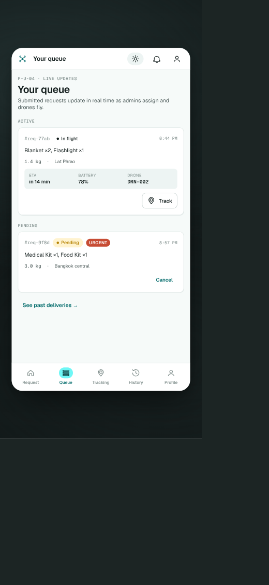

**Purpose.** Live status of the user's own active requests; one tap from any of them into Tracking.

**Layout.**
- Header "Your queue", subtitle "Submitted requests update in real time as admins assign and drones fly."
- **ACTIVE** section: one card per request whose status is in `{pending, approved, in_flight, delivered}`. Each card shows ID, status pill, items summary, weight, delivery label, and — if `currentFlightId` is set — a metrics row (ETA · Battery · Drone) + `Track` button → `/user/tracking/{flightId}`.
- **PENDING** section (compact): pending requests with an `Urgent` chip if relevant; trailing `Cancel` text button (only while status is `pending`).
- Footer link "See past deliveries →" jumps to P-U-07.

**Data.** Firestore listener on `requests` where `userId == uid` and `status in [pending, approved, in_flight, delivered]`, ordered by `createdAt desc`.

**Actions.**
- `Cancel` → `cancelRequest` callable (admin allowed any time before in_flight; user allowed only while `pending`).
- `Track` → push tracking route (renders P-U-05).

---

## P-U-05 — Tracking flight

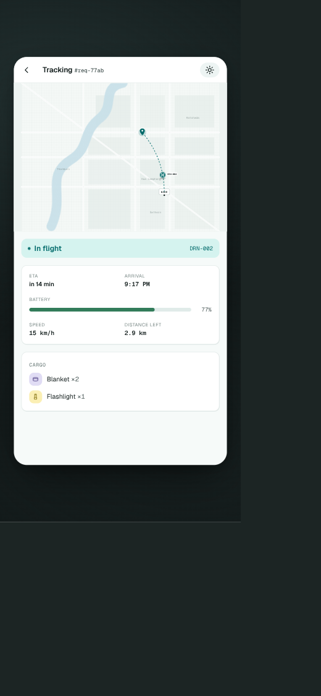

**Purpose.** Live in-flight view for a single flight.

**Layout (fullscreen, no bottom nav).**
- Back arrow + "Tracking #{reqId}".
- **Map.** `flutter_map` w/ OSM tiles; markers for origin (BASE), destination pin, drone marker animated along the path. Path: dotted polyline from base → destination, solid behind the drone marker as it advances.
- **Status banner.** "● In flight" (or "Delivering", "Returning", "Aborted") + drone ID on the right.
- **Metrics grid (2 cols × 3 rows):** ETA, Arrival (clock time), Battery, Speed, Distance left.
- **Cargo card.** Each item with icon, name, ×qty.

**Data.** Snapshot listener on `flights/{flightId}`; the live metrics derive from `snapshot()` in `functions/src/lib/sim.ts` (server) — the client computes the visible position from `takeoffAt`, `speedKmh`, `weatherModifierAtTakeoff`, and now() so the UI doesn't have to wait for the per-minute `tickFlights` write.

**Edge cases.**
- Flight aborted: status pill goes red, banner copy "Flight aborted — reason"; map drone marker fades; bottom shows "Awaiting reassignment" hint and back-button takes the user to P-U-04.

---

## P-U-06 — Confirm receipt (Finalize)

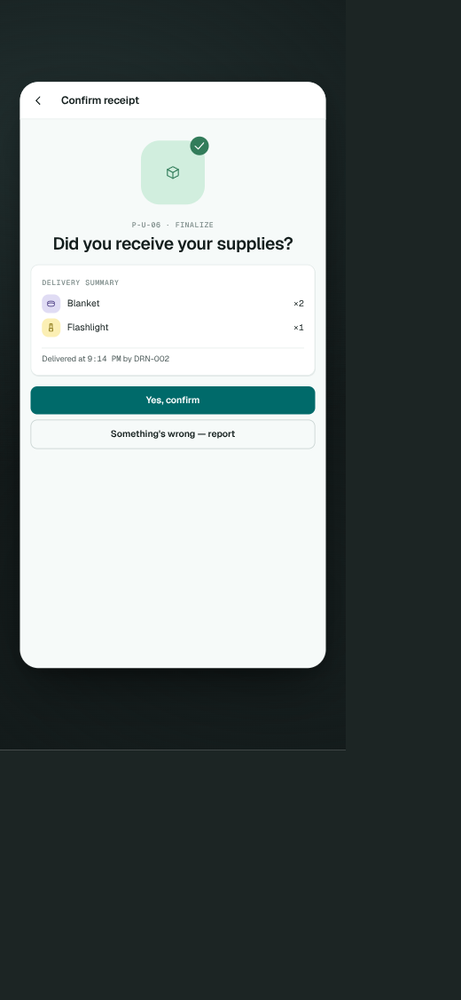

**Purpose.** Close the loop after a delivery; required before the drone goes "returning" and the request marks `confirmed`.

**Layout (fullscreen modal-feel).**
- Back arrow + "Confirm receipt".
- Hero: rounded square package icon with a green check badge.
- Eyebrow `P-U-06 · FINALIZE` + h1 "Did you receive your supplies?".
- **Delivery summary card.** Item rows with ×qty. Footer line "Delivered at {time} by DRN-{id}".
- Primary CTA `Yes, confirm` → `confirmDelivery` callable.
- Secondary `Something's wrong — report` → opens a small dialog with a textarea + submit (this is a placeholder for the dispute flow — out of scope for v1, but the button must exist per the prototype).

**Entry points.** Push notification deep-link `/user/confirm/{reqId}`, or tap on the matching card in P-U-04 once status is `delivered`.

---

## P-U-07 — History (past deliveries)

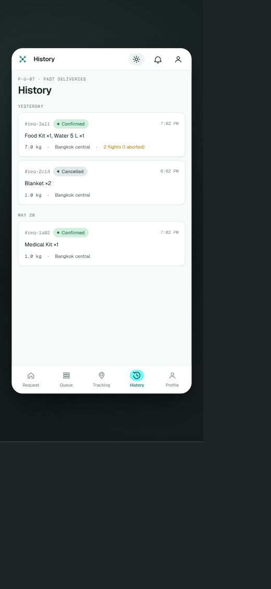

**Purpose.** Read-only audit of every request the user has made.

**Layout.**
- Day-grouped list ("Yesterday", "May 20", …) of compact cards: request ID, status pill (`Confirmed` / `Cancelled` / `Failed`), items summary, weight, delivery label, and — when applicable — a small footnote ("2 flights (1 aborted)") so the user can see retried deliveries.

**Data.** Same `requests` listener as P-U-04 but filtered to `status in [confirmed, cancelled, failed]`. Group by `createdAt` calendar day in the device's local time.

**Detail view.** Tapping a card pushes a read-only request detail (re-use the layout of P-U-04's active card but with all metrics frozen at completion time). Not separately documented — uses the same widget tree.

---

## P-U-08 — Notifications

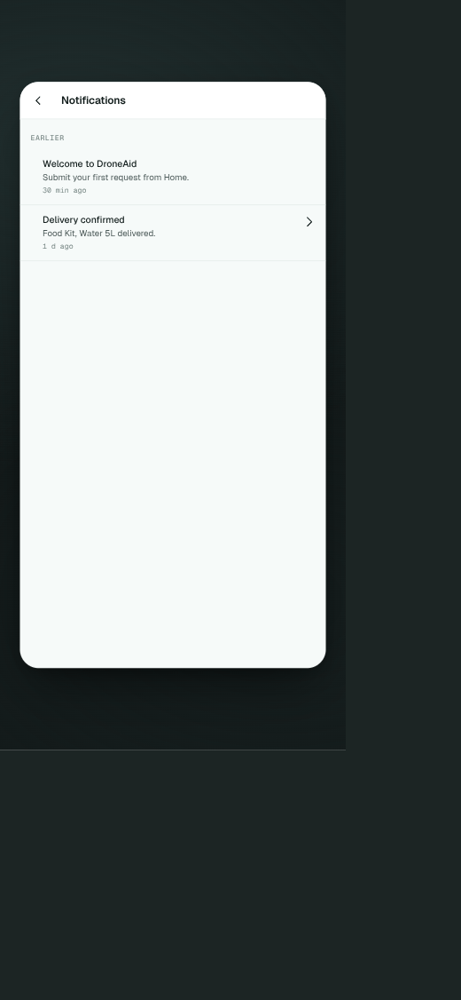

**Purpose.** All FCM notifications surfaced in-app so the user can re-read them.

**Layout.**
- Back arrow + "Notifications".
- Sectioned list: `Earlier` (24h+), `Today` (within last 24h). Each row: title (bold), body, timestamp ("30 min ago", "1 d ago"). Rows with a deep-link have a chevron on the right.

**Data.** Local cache of received FCM messages plus a server-side mirror at `users/{uid}/notifications/{id}`. Marking-as-read = update `readAt` via a lightweight callable (`markNotifRead` in the prototype) — not yet implemented server-side.

---

## P-U-09 — Profile + settings

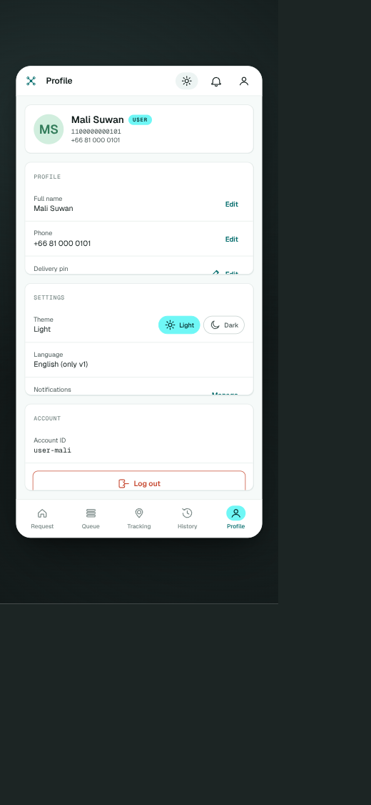

**Purpose.** Self-service edits + theme/notification toggles + logout.

**Layout.**
- Header card: avatar circle ("MS" initials), name, USER badge, national ID, phone.
- **PROFILE** card: `Full name`, `Phone`, `Delivery pin` — each with an inline `Edit` action.
- **SETTINGS** card:
  - `Theme` row with `Light` / `Dark` pill (binds to `prefs.theme`).
  - `Language` row (read-only "English (only v1)").
  - `Notifications` row with a `Manage` action (opens OS-level settings via `permission_handler` in a real build).
- **ACCOUNT** card: `Account ID` (read-only), bottom-aligned destructive `Log out` button.

### P-U-09 a — Log-out confirmation dialog

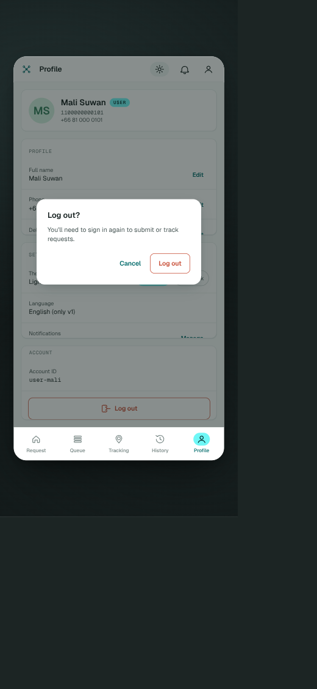

Modal: "Log out?" + body "You'll need to sign in again to submit or track requests." + actions `Cancel` (text) and `Log out` (destructive). Show as a Material `AlertDialog` (not a bottom sheet) to match the prototype.

**Data.** All field edits go through `updateProfile` callable (already implemented). The callable accepts a sparse patch, so the page only sends fields the user actually changed.

---

## P-A-01 — Triage (admin requests)

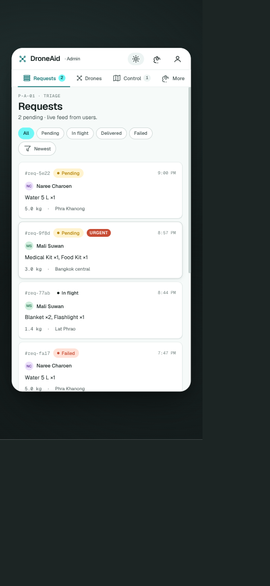

**Purpose.** Admin's default landing tab — live triage feed.

**Layout.**
- Header `P-A-01 · TRIAGE`, h1 "Requests", subtitle "{n} pending · live feed from users."
- **Filter row:** `All` (default, primary chip) / `Pending` / `In flight` / `Delivered` / `Failed`.
- **Sort:** trailing pill — `Newest` (default).
- **List.** One card per request: small ID, status pill (+ `URGENT` chip if `priority === "urgent"`), timestamp, requester avatar/name, items summary, weight, delivery label. The Requests badge in the top tab shows the count of currently `pending` requests.

**Data.** Firestore listener on `requests` ordered by `createdAt desc`. The "Pending" count drives the badge.

**Actions.** Tap a card → P-A-02.

---

## P-A-02 — Request manage

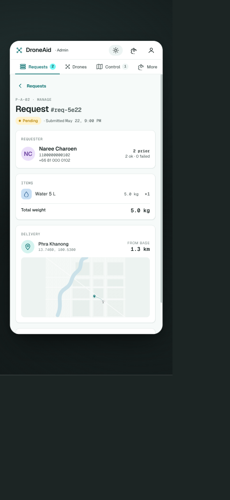

**Purpose.** Approve, reject, or reassign a single request; trigger drone dispatch.

**Layout.**
- Breadcrumb back ("‹ Requests") + eyebrow `P-A-02 · MANAGE` + h1 "Request #{reqId}".
- Status pill + "· Submitted {date}, {time}".
- **REQUESTER** card: avatar, name, national ID, phone, on the right "{n} prior — {x} ok · {y} failed" (denormalized counters).
- **ITEMS** card: one row per item (icon + name + "{kg} kg ×{qty}"); footer "Total weight  {kg} kg".
- **DELIVERY** card: pin icon + place label + lat/lng on the left, "FROM BASE — {km} km" on the right; below it a static mini-map. Distance comes from `haversineKm` in `functions/src/lib/geo.ts` (or recomputed client-side for the map).
- **ACTION** card (below the fold): primary `Approve` (filled, opens drone-selection sheet), secondary `Reject` (outlined, opens reason input). For an `approved` or `failed` request, the primary becomes `Assign drone` and opens the eligible-drone list from `approveRequest`'s response.

**Data + writes.** Reads `requests/{reqId}` + the user doc + each `catalog/{id}`. Writes via callables: `approveRequest`, `rejectRequest`, `assignDrone`.

**Hidden states.**
- Out-of-stock at approve time → callable throws `failed-precondition`; show a snackbar and refresh the items section.
- No eligible drones → empty state in the assign sheet with a hint "Bring a drone idle, then retry."

---

## P-A-03 — Fleet (drones)

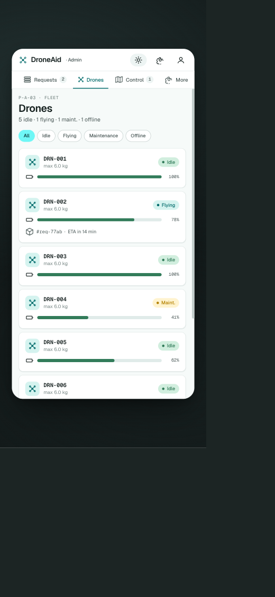

**Purpose.** Inventory of every drone with battery + status at a glance.

**Layout.**
- Header `P-A-03 · FLEET`, h1 "Drones", subtitle "{idle} idle · {flying} flying · {maint.} maint. · {offline} offline".
- **Filter row:** `All` / `Idle` / `Flying` / `Maintenance` / `Offline`.
- **Drone cards** (tappable to P-A-04):
  - Drone icon + ID + "max {kg} kg".
  - Status pill (right): `Idle` (green), `Flying` (teal), `Maint.` (yellow), `Offline` (grey).
  - Battery row: thin bar + percent number on the right.
  - Flying cards add a footer: "{reqId} · ETA in {min}".

**Data.** Firestore listener on `drones` (small collection, no pagination needed).

---

## P-A-04 — Drone detail

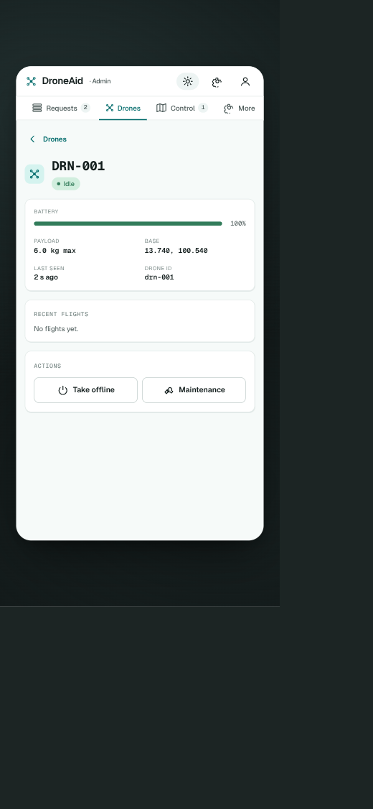

**Purpose.** Per-drone telemetry + manual ops controls.

**Layout.**
- Back chip "‹ Drones" + drone icon + bold ID + status pill.
- **BATTERY** row: full-width bar + percent.
- 2×2 metric grid: `PAYLOAD` (max kg), `BASE` (lat, lng), `LAST SEEN` (relative), `DRONE ID` (raw doc ID, mono).
- **RECENT FLIGHTS** card: empty state when none ("No flights yet."), otherwise the last 5 flights with status + time.
- **ACTIONS** card: two outlined buttons — `Take offline` (toggles `status: offline`), `Maintenance` (toggles `status: maintenance`). Both call `toggleDroneMaintenance` / a sibling `toggleDroneOffline` callable.

**Rules.** Direct writes to `drones` are denied; all transitions go through callables, which themselves enforce that an `in_flight`-bound drone can't be flipped offline without first aborting the flight.

---

## P-A-05 — Control (live map)

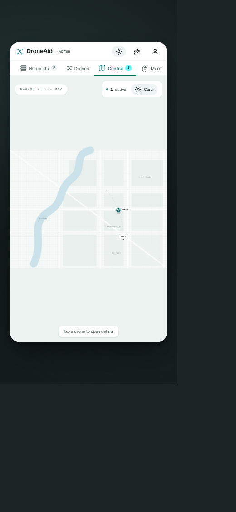

**Purpose.** One unified map of every active flight and base.

**Layout.**
- Top strip on the right: `{n} active` pill + current weather chip (`Clear` / `Wind` / `Storm`).
- **Map** fills the rest of the screen. Markers: each idle drone at its base (small grey icon), each active flight (teal animated marker on its polyline), one `BASE` label. Polylines: dotted ahead, solid behind the drone marker.
- Footer hint pill "Tap a drone to open details" — tapping a drone marker pushes P-A-04.

**Data.** Combine the `flights` listener (active statuses only) with the `drones` listener. Pre-compute marker positions client-side using the same `snapshot()` math as P-U-05 so the marker animates between server ticks.

---

## P-A-06 — Operational weather

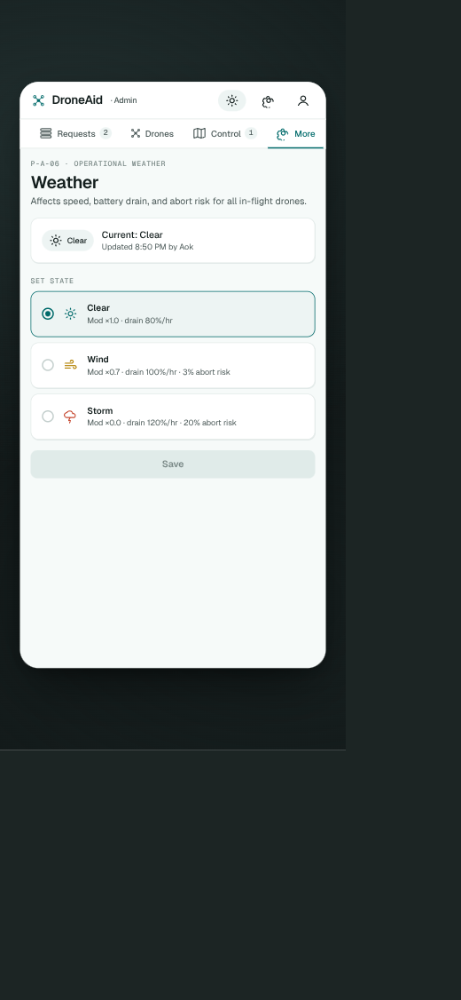

**Purpose.** One global weather state that adjusts speed, battery drain and abort risk for every flight.

**Layout.**
- Header `P-A-06 · OPERATIONAL WEATHER`, h1 "Weather", subtitle "Affects speed, battery drain, and abort risk for all in-flight drones."
- **Current state card:** large pill on the left ("☀ Clear") + "Current: clear" + "Updated {time} by {admin}" on the right.
- **SET STATE** radio group:
  - `Clear` — `Mod ×1.0 · drain 80%/hr`
  - `Wind` — `Mod ×0.7 · drain 100%/hr · 3% abort risk`
  - `Storm` — `Mod ×0.0 · drain 120%/hr · 20% abort risk`
- Filled `Save` button at the bottom; **disabled while the draft equals the current state** (so it can't be no-op-submitted).

**Data + writes.** Reads `weather/current`. Writes via `setWeather` callable — admin-only by rules. The next `tickFlights` run applies the new modifier to every active flight in its math.

---

## P-A-07 — Stock control (inventory)

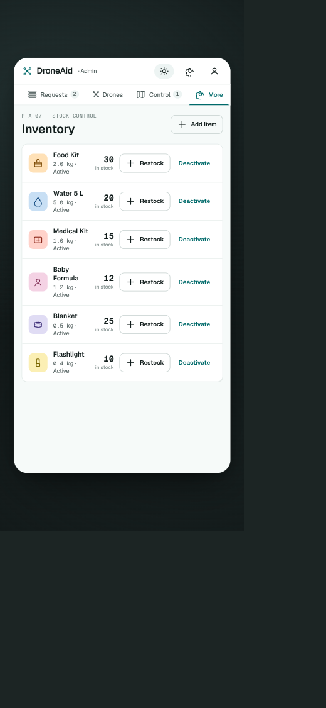

**Purpose.** Restock the catalog and toggle items active/inactive.

**Layout.**
- Header `P-A-07 · STOCK CONTROL`, h1 "Inventory", top-right outlined `+ Add item` button.
- **Item rows** (one per `catalog/{id}`): coloured square icon, name + "{kg} kg · Active/Inactive" caption, large in-stock number, `+ Restock` button (opens a small numeric dialog), `Deactivate` link button.

**Data + writes.**
- `restockItem` callable adds an integer to `stock` (server-side `FieldValue.increment`).
- `toggleCatalogActive` flips `active`. Deactivated items are still shown here but vanish from P-U-03.
- `createCatalogItem` for new items.

**Open issue.** In the prototype, the "More" tab opens Weather, and Inventory is only reachable by calling `actions.go("admin.inventory")`. The real implementation needs an explicit Inventory link — easiest is to make the "More" tab open a small sheet/menu with `Weather`, `Inventory`, `Profile`, instead of routing straight to Weather.

---

## File index

| Page | ID | Screenshot |
|---|---|---|
| Log in | P-U-01 | `prototype-screens/user/P-U-01_login.png` |
| Create an account | P-U-02 | `prototype-screens/user/P-U-02_register.png` |
| Request supplies | P-U-03 | `prototype-screens/user/P-U-03_request.png` |
| Your queue | P-U-04 | `prototype-screens/user/P-U-04_queue.png` |
| Tracking | P-U-05 | `prototype-screens/user/P-U-05_tracking.png` |
| Confirm receipt | P-U-06 | `prototype-screens/user/P-U-06_confirm.png` |
| History | P-U-07 | `prototype-screens/user/P-U-07_history.png` |
| Notifications | P-U-08 | `prototype-screens/user/P-U-08_notifications.png` |
| Profile | P-U-09 | `prototype-screens/user/P-U-09_profile.png` |
| Log-out dialog | P-U-09 a | `prototype-screens/user/P-U-09a_logout_dialog.png` |
| Admin · Requests | P-A-01 | `prototype-screens/admin/P-A-01_admin_requests.png` |
| Admin · Request manage | P-A-02 | `prototype-screens/admin/P-A-02_request_manage.png` |
| Admin · Drones | P-A-03 | `prototype-screens/admin/P-A-03_drones.png` |
| Admin · Drone detail | P-A-04 | `prototype-screens/admin/P-A-04_drone_detail.png` |
| Admin · Control map | P-A-05 | `prototype-screens/admin/P-A-05_control_map.png` |
| Admin · Weather | P-A-06 | `prototype-screens/admin/P-A-06_weather.png` |
| Admin · Inventory | P-A-07 | `prototype-screens/admin/P-A-07_inventory.png` |
